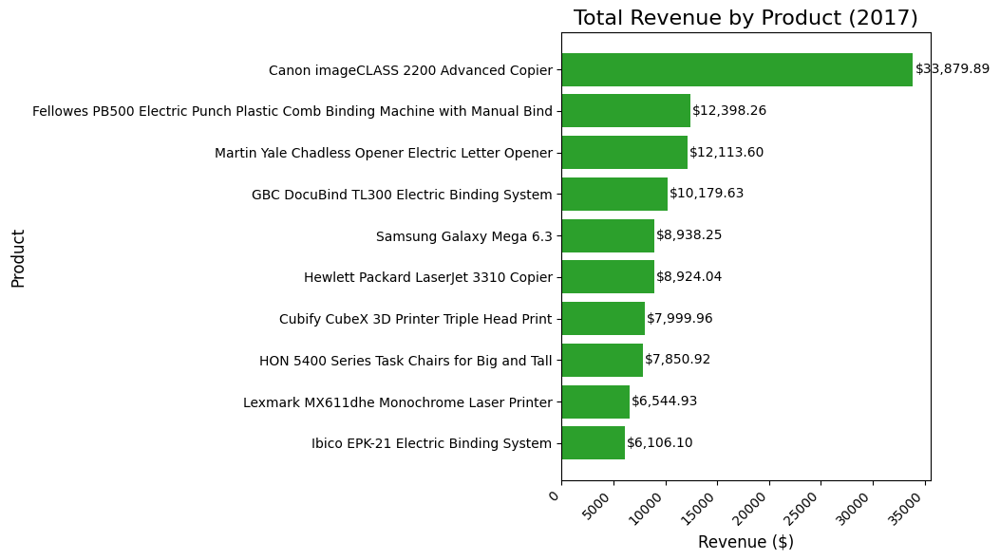

# SQL Business Intelligence Automator

## Executive Summary
This project provides an end-to-end automated data pipeline that transforms raw commercial data into actionable business intelligence. 

## The Problem: Manual Data Processing & Reporting Bottlenecks
Organizations often rely on manual data extraction and spreadsheet manipulation to generate monthly performance metrics. This approach is:
* **Time-consuming:** Hours spent formatting data instead of analyzing it.
* **Error-prone:** High risk of human error during manual data manipulation.
* **Unscalable:** Difficult to adapt as data volume grows.

## The Solution: Automated Data Ingestion & Reporting (What I Built)
I engineered a Python-based automation pipeline that seamlessly ingests raw sales data, structures it within a relational database, and automatically generates ready-to-present financial reports and visualizations.

### 1. Centralized Data Architecture (Solved Data Silos)
* **Action:** Created `data_loader.py` to parse raw inputs (e.g., `data/Sample - Superstore.csv`).
* **Result:** Automatically normalizes and loads the data into a secure `business.db` SQLite database, establishing a single source of truth.

### 2. Automated Analytics & Visualization (Solved Reporting Delays)
* **Action:** Developed `report_gen.py` to execute SQL queries directly against the database.
* **Result:** Instantly outputs aggregated tabular data (`reports/monthly_revenue_report.csv`) and visual trend analysis (`reports/revenue_chart.png`) without manual intervention.

## Generated Business Intelligence
The pipeline automatically produces the following deliverables:

### Revenue Trend Analysis

### Tabular Reports
The numerical breakdown is exported to `reports/monthly_revenue_report.csv` for stakeholder review.

---

## 🚀 Deployment Instructions

**1. Initialize the Database**
Run the ingestion script to process the raw CSV and build the local database:

    python data_loader.py

**2. Generate Insights**
Run the reporting script to generate the CSV report and PNG charts:

    python report_gen.py